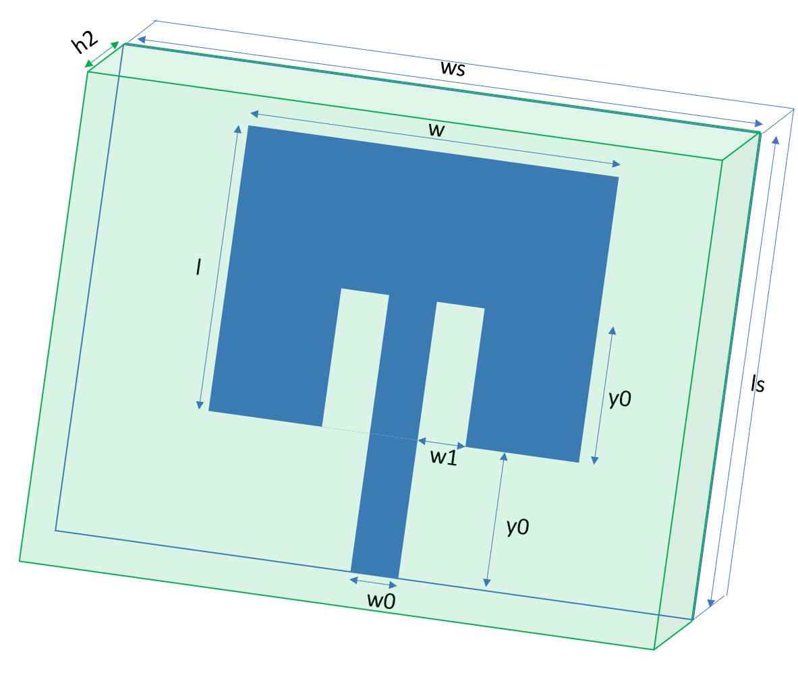
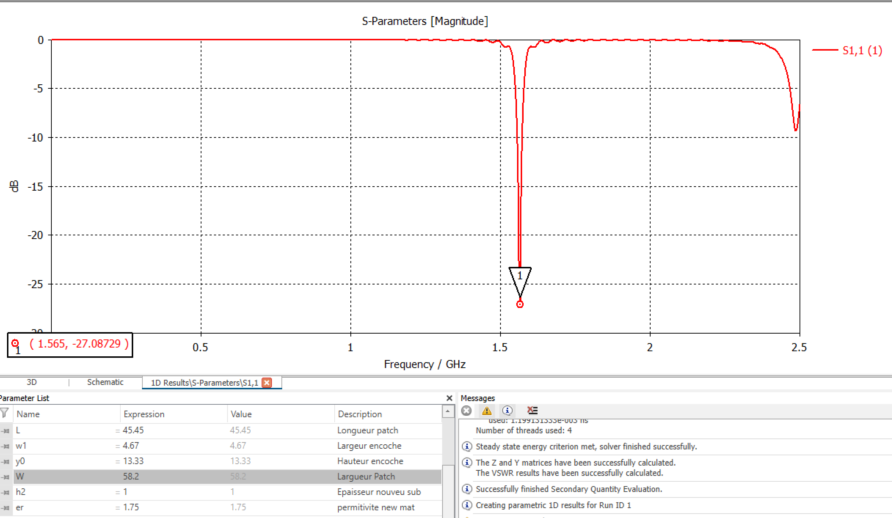

# Cahier de laboratoire TSM_AppElm

## Informations importantes

### Paramètres d'une antenne

- Paramètres physique
  - Taille
  - Matériaux $\epsilon_r$ 
  - Permittivité $\sigma$ 
- Paramètres circuit ( avec graphique )
  - $S_{11}$ vs $f$
  - $S_{11}$ @ $f_r$
  - Bande passante -> -10[dB] ou -6[dB]
- Paramètres de rayonnement (transmission)
  - Gain
  - Efficacité
  - Directivité
  - Diagramme de rayonnement 3D/2D/1Dpolaire
  - Angle d'ouverture @-3dB (en 2D voir info max est entre les deux points à -)

## Antenne planaire dipôle

$e$ : épaisseur cuivre ($35$ $\mu m$)

$h$ : épaisseur substrat ($1.6$ $mm$)

$\epsilon_r$ : permittivité du substrat (FR4:4 et CER:9.9)

### Evolution des paramètres sur la physique

Tableau de variation des paramètre physique sur les paramètres du circuit

$\Delta f$ = variation de la fréquence de résonance

$\Delta S_{11}$ = variation de la profondeur du pic du $S_{11}$ 

### Tableau de modification de l'antenne dipôle FR4

| $\Delta = 10\%$            | $ref$ [mm] | $\Delta f$ [MHz] | $\Delta S_{11}$ [dB] |
| -------------------------- | ---------- | ---------------- | -------------------- |
| i (largeur piste)          | 0.8        | $\uparrow$ 4     | $\downarrow$ 0.216   |
| ws (Largeur PCB)           | 30         | 0                | $\uparrow$ 0.059     |
| ls (Longueur PCB)          | 120        | 0                | $\uparrow$ 0.010     |
| l1 (longueur brin antenne) | 4          | $\downarrow$ 24  | $\uparrow$ 0.927     |
| l2 (largeur brin antenne)  | 19.5       | $\downarrow$ 188 | $\downarrow$ 1.030   |

### Tableau de modification de l'antenne dipôle Céramique (alumina 99% lossfree)

| $\Delta = 10\%$            | $ref$ [mm] | $\Delta f$ [MHz] | $\Delta S_{11}$ [dB] |
| -------------------------- | ---------- | ---------------- | -------------------- |
| i (largeur piste)          | 0.8        | $\uparrow$ 8     | $\downarrow$ 0.1933  |
| ws (Largeur PCB)           | 20         | $\downarrow$ 4   | $\uparrow$ 0.05154   |
| ls (Longueur PCB)          | 100        | 0                | $\downarrow$ 0.07415 |
| l1 (longueur brin antenne) | 2          | $\downarrow$ 16  | $\uparrow$ 0.4974    |
| l2 (largeur brin antenne)  | 16         | $\downarrow$ 184 | $\downarrow$ 0.42109 |

## Antenne patch

### Tableau de modification de l'antenne patch FR4

| $\Delta = +10\%$         | $ref$ [mm] | $\Delta f$ [MHz] | $\Delta S_{11}$ [dB] |
| ------------------------ | ---------- | ---------------- | -------------------- |
| ws (Largeur PCB)         | 120        | -3.6             | -3.93                |
| ls (Hauteur PCB)         | 120        | -3.4             | -5.46                |
| w (largeur patch)        | 58.2       | -8               | -9.85                |
| l (hauteur patch)        | 45.45      | -136.8           | +4.115               |
| w0 (largeur piste alim)  | 1.58       | +0.087           | +1.15                |
| w1 (largeur encoche)     | 4.67       | +2               | -2.95299             |
| y0 (hauteur encoche)     | 13.33      | -2               | -18.12               |
| y1 (longueur piste alim) | 24.29      | 2                | +1.77                |

### Tableau de modification de l'antenne patch CER

| $\Delta = +10\%$         | $ref$ [mm] | $\Delta f$ [MHz] | $\Delta S_{11}$ [dB] |
| ------------------------ | ---------- | ---------------- | -------------------- |
| ws (Largeur PCB)         | 80         | -1               | -8.53                |
| ls (Hauteur PCB)         | 80         | -1               | -5.457               |
| w (largeur patch)        | 43.8       | -10              | +8.66                |
| l (hauteur patch)        | 29.9       | -128             | +10.38               |
| w0 (largeur piste alim)  | 1.58       | +0.8             | +1.65                |
| w1 (largeur encoche)     | 3          | +1               | +4.3                 |
| y0 (hauteur encoche)     | 10         | -3               | +11.44               |
| y1 (longueur piste alim) | 22         | -0.3             | +5.11                |

## Simulation de la mesure de la permittivité d'un matériau

| Dimensions                                      | $ref$ [mm] |
| ----------------------------------------------- | ---------- |
| ws (Largeur PCB)                                | 120        |
| ls (Hauteur PCB)                                | 120        |
| w (largeur patch)                               | 58.2       |
| l (hauteur patch)                               | 45.45      |
| w0 (largeur piste alim)                         | 1.58       |
| w1 (largeur encoche)                            | 4.67       |
| y0 (hauteur encoche)                            | 13.33      |
| y1 (longueur piste alim)                        | 24.29      |
| h2 (Epaisseur matériau sous test)               | 1          |
| $\epsilon_r$ (permittivité du nouveau matériau) | 1.75       |

